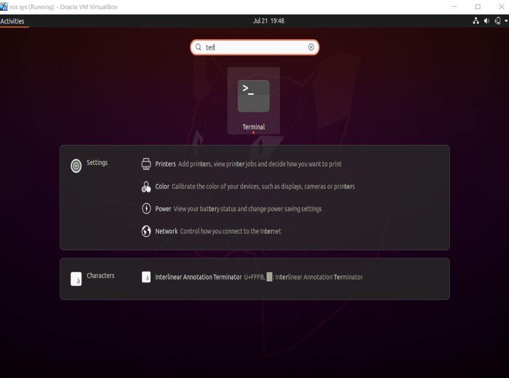
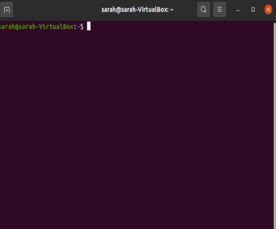
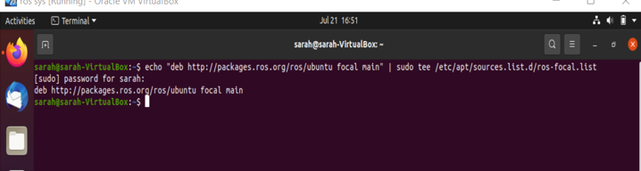
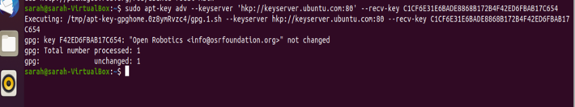
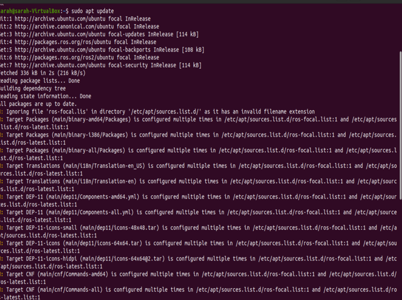
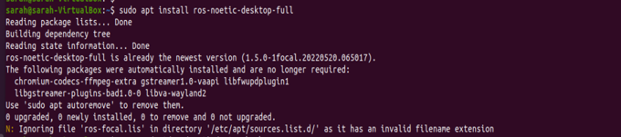
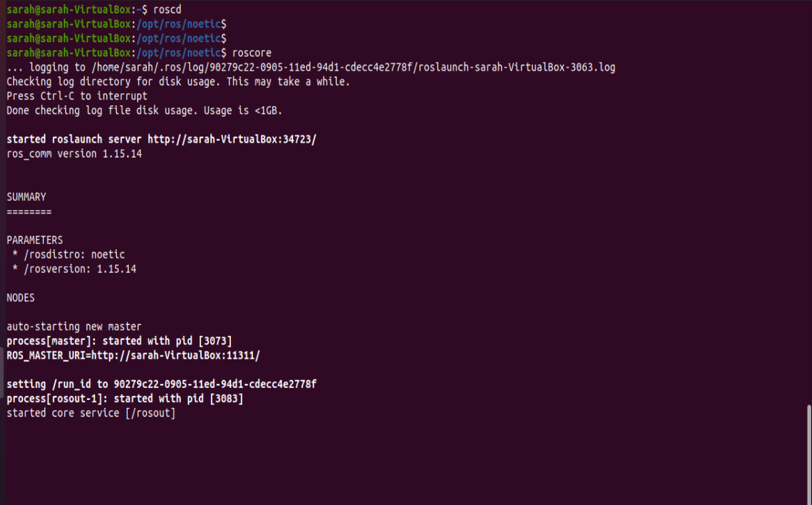

# install ROS Noetic on ubuntu

Before starting to install ROS, you need to :

 **download VirtualBox :**  https://www.virtualbox.org/wiki/Downloads 

 **download Ubuntu 18.04 ( Install it on Virtual Box ) :** https://releases.ubuntu.com/18.04/ 

if VirtualBox and Ubuntu are not familiar to you, here is some help to do that: https://youtu.be/vBSSGmZU7Bc

# install ROS 

run this instruction in ubuntu terminal

  
  

**1- Add Official Noetic repo to Ubuntu**

First, add the official ROS Noetic repository to Ubuntu sources list file by running the following command:

> echo "deb http://packages.ros.org/ros/ubuntu focal main" | sudo tee /etc/apt/sources.list.d/ros-focal.list

it will ask you for your ubuntu password, write it then enter

the output :

**2. Add official ROS keyring**

Add the official ROS keyring to your Ubuntu system.

Use the Ubuntu key server :  

> sudo apt-key adv --keyserver 'hkp://keyserver.ubuntu.com:80' --recv-key C1CF6E31E6BADE8868B172B4F42ED6FBAB17C654

**Note:** if  "hkp://keyserver.ubuntu.com:80"  does not work, try " hkp://pgp.mit.edu:80 "

Now use the curl command to download the official ROS keyring and add it locally : 

> curl -sSL 'http://keyserver.ubuntu.com/pks/lookup?op=get&search=0xC1CF6E31E6BADE8868B172B4F42ED6FBAB17C654' | sudo apt-key add -

After running it, you will see "OK," which means the key has successfully been added.

**3- Update the ROS package**

Now you  will update your Ubuntu system to get the ROS Noetic package information from the repository :

> sudo apt update

 This will take some time to sync the newly added repository with the online Ubuntu repositories.
 
 Note: I've done this step before, but you should see something like this:
 
 

**4- Install ROS Noetic on Ubuntu** 

ROS has several metapackages you can choose to install according to your specific needs.

I am going to install ros-noetic-desktop-full, the one I need:

> sudo apt install ros-noetic-desktop-full

as I mentioned before, I've done this before, but you should get something similar to this:

 

you can install the other metapackages by the following command :

- Install ros-noetic-desktop 

> sudo apt install ros-noetic-desktop

- Install ros-noetic-base 

> sudo apt install ros-noetic-base

- Install ros-noetic-core 

> sudo apt install ros-noetic-core

**5- Set up ROS Noetic environment**

First source the setup.bash script in every bash terminal that uses ROS :

> source /opt/ros/noetic/setup.bash

Add in the '.bashrc' file located in your home directory to avoid running each time when you launch a new shell:

> echo "source /opt/ros/noetic/setup.bash" >> ~/.bashrc

Verify :

> tail ~/.bashrc

For the changes to take effect :

> source ~/.bashrc

**6- Verify Noetic installation**

After successfully installing ROS Noetic on Ubuntu run the command: 

> roscd

You will notice that the current directory of your prompt changes to  /opt/ros/noetic, which is where we installed Noetic.

verify the installation by running the command

>roscore

it is printing ros distribution and version

 

